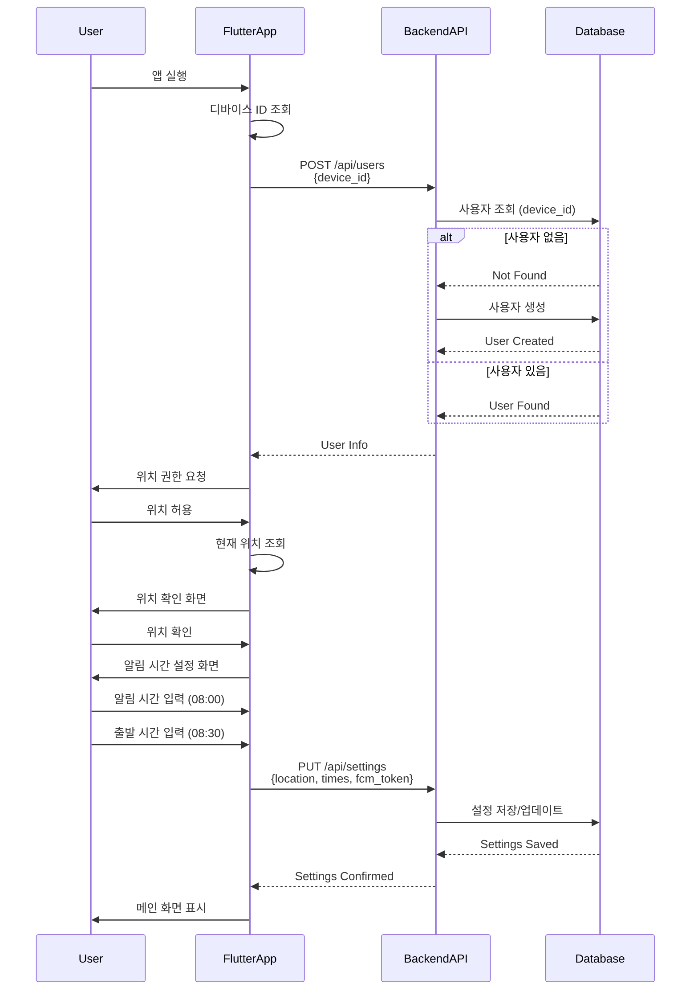
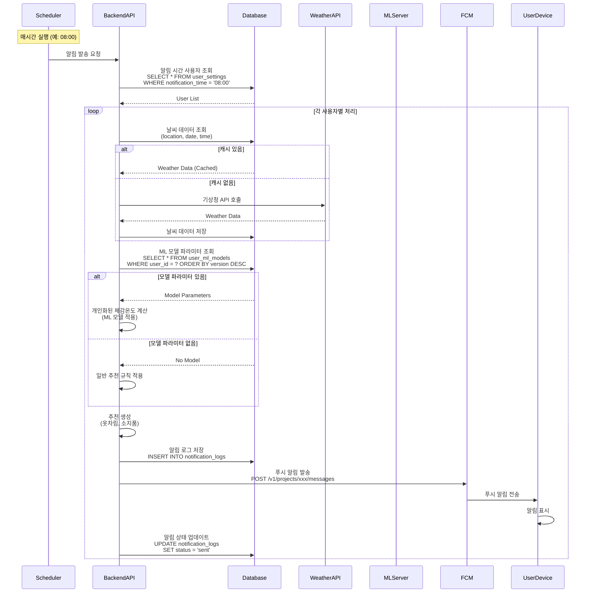
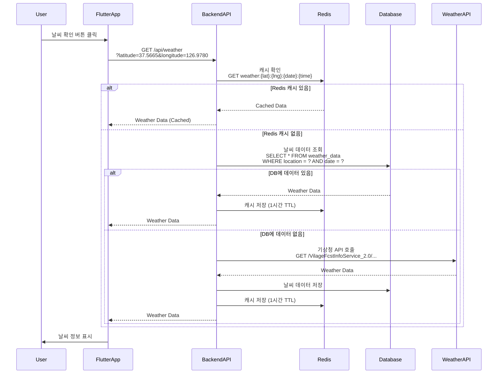
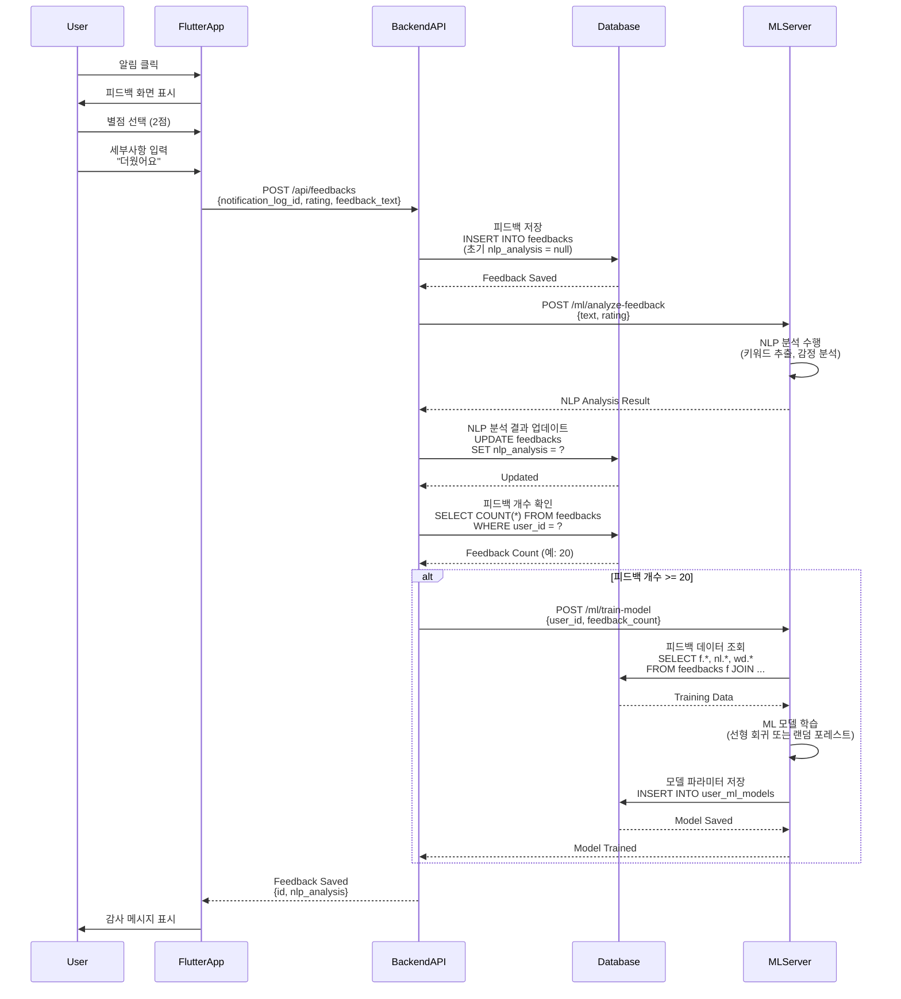
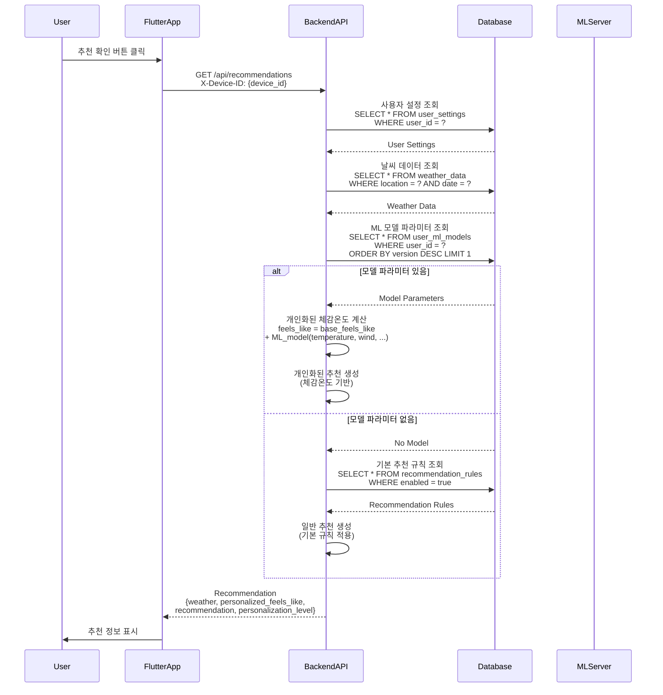
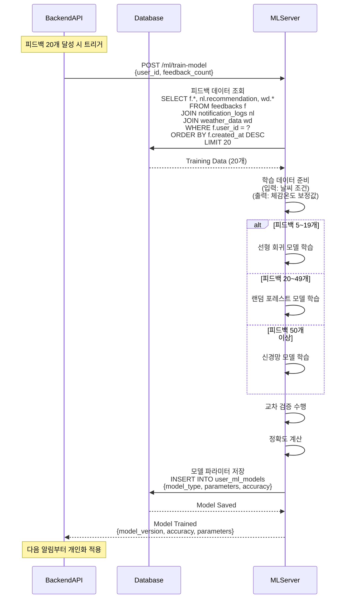
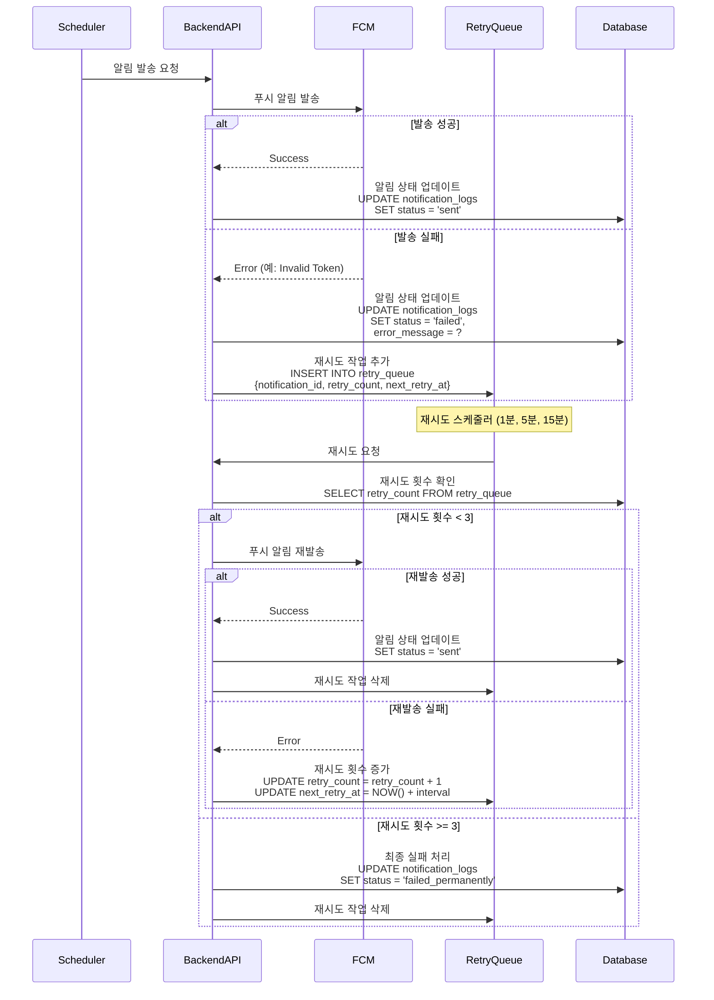
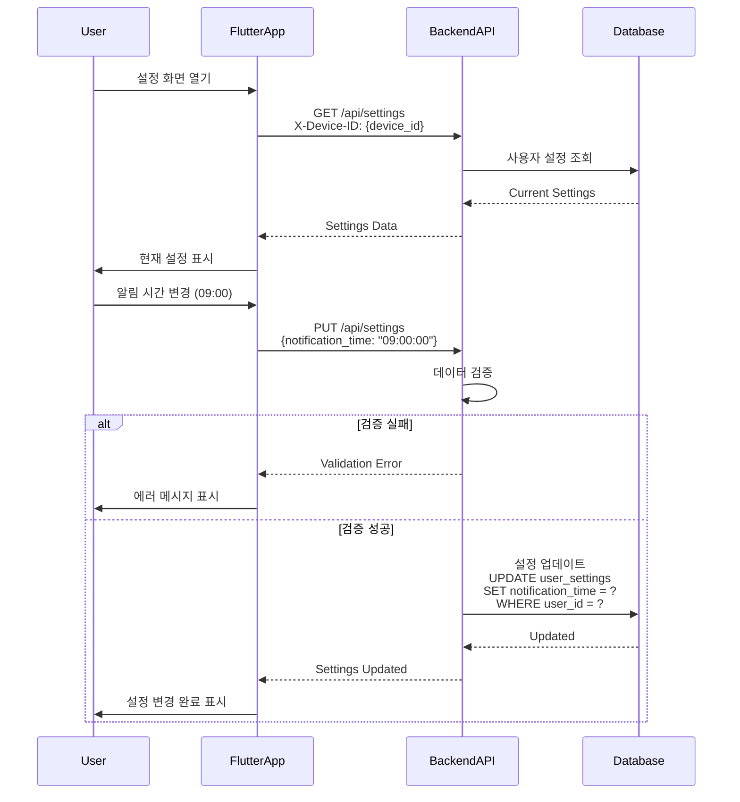
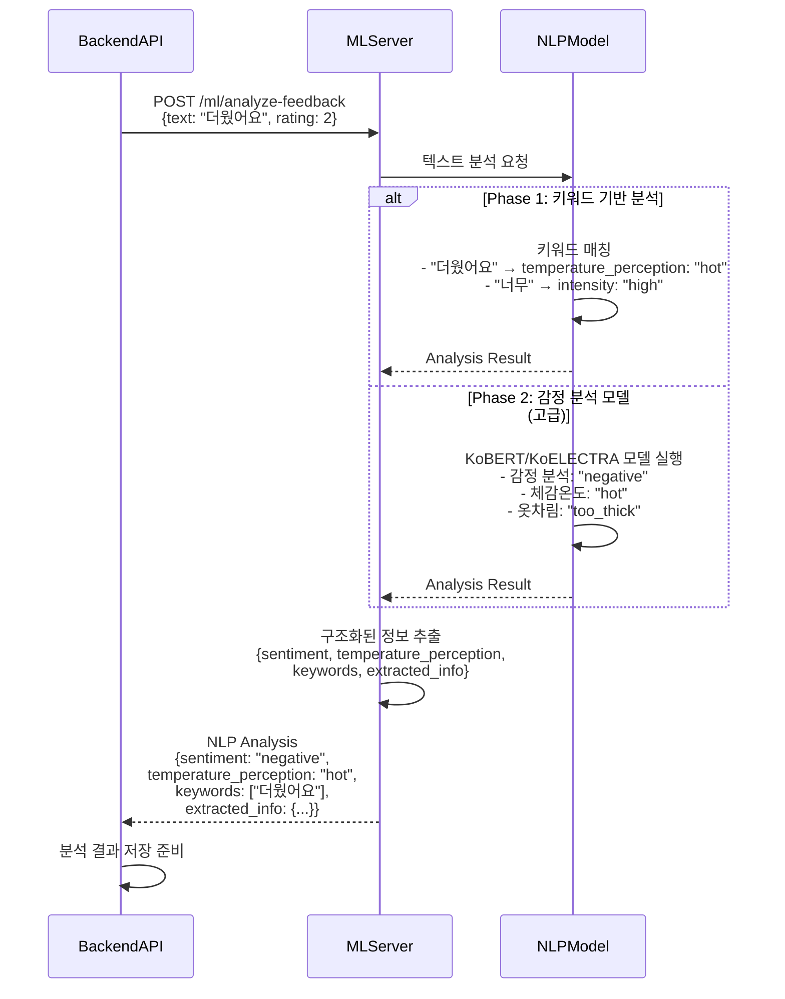
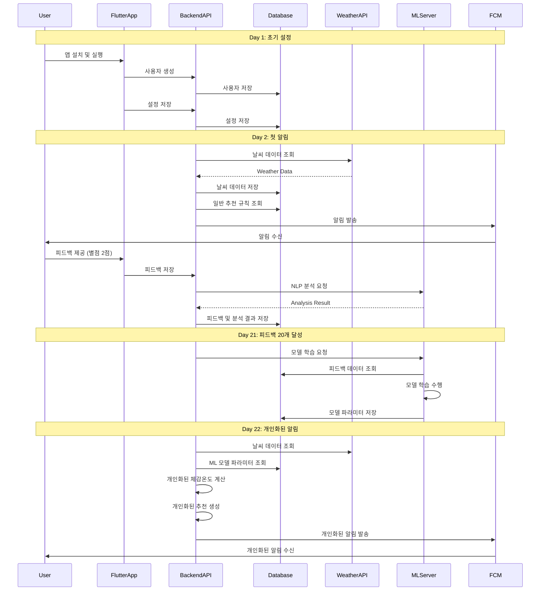

# Sequence Diagrams

## 1. 사용자 온보딩 시퀀스

## 2. 알림 발송 시퀀스

## 3. 날씨 데이터 조회 시퀀스

## 4. 피드백 제출 시퀀스

## 5. 개인화된 추천 조회 시퀀스

## 6. ML 모델 학습 시퀀스 (상세)

## 7. 알림 재시도 시퀀스

## 8. 사용자 설정 변경 시퀀스

## 9. NLP 분석 시퀀스 (상세)

## 10. 전체 시스템 상호작용 시퀀스 (통합)

## 시퀀스 다이어그램 요약

| 시퀀스 | 주요 액터 | 설명 |
|--------|----------|------|
| **사용자 온보딩** | User, FlutterApp, BackendAPI, Database | 앱 설치부터 설정 완료까지 |
| **알림 발송** | Scheduler, BackendAPI, Database, WeatherAPI, MLServer, FCM | 정기 알림 발송 프로세스 |
| **날씨 데이터 조회** | User, FlutterApp, BackendAPI, Redis, Database, WeatherAPI | 날씨 데이터 캐싱 전략 |
| **피드백 제출** | User, FlutterApp, BackendAPI, Database, MLServer | 피드백 저장 및 NLP 분석 |
| **개인화된 추천** | User, FlutterApp, BackendAPI, Database, MLServer | ML 모델 기반 추천 생성 |
| **ML 모델 학습** | BackendAPI, Database, MLServer | 사용자별 모델 학습 프로세스 |
| **알림 재시도** | Scheduler, BackendAPI, FCM, RetryQueue | 실패한 알림 재시도 로직 |
| **설정 변경** | User, FlutterApp, BackendAPI, Database | 사용자 설정 업데이트 |
| **NLP 분석** | BackendAPI, MLServer, NLPModel | 피드백 텍스트 분석 |
| **전체 시스템** | 모든 컴포넌트 | 전체 시스템 통합 흐름 |

